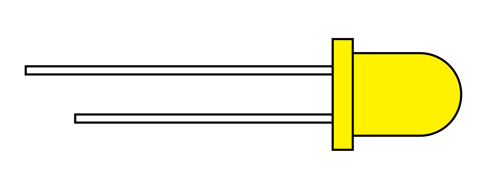

## Single LED Shape

Single LEDs or light emitting diodes have a long end the "anode" or positive + end and a short end the "cathode" or negative - end. Sometime the negative side of the LED is flattened to help identify it.

They typically run on 2 - 3 volts so when running LEDs from a 5V source such as an Arduino, then a resistor is needed to limit the current to not damage the LED.
