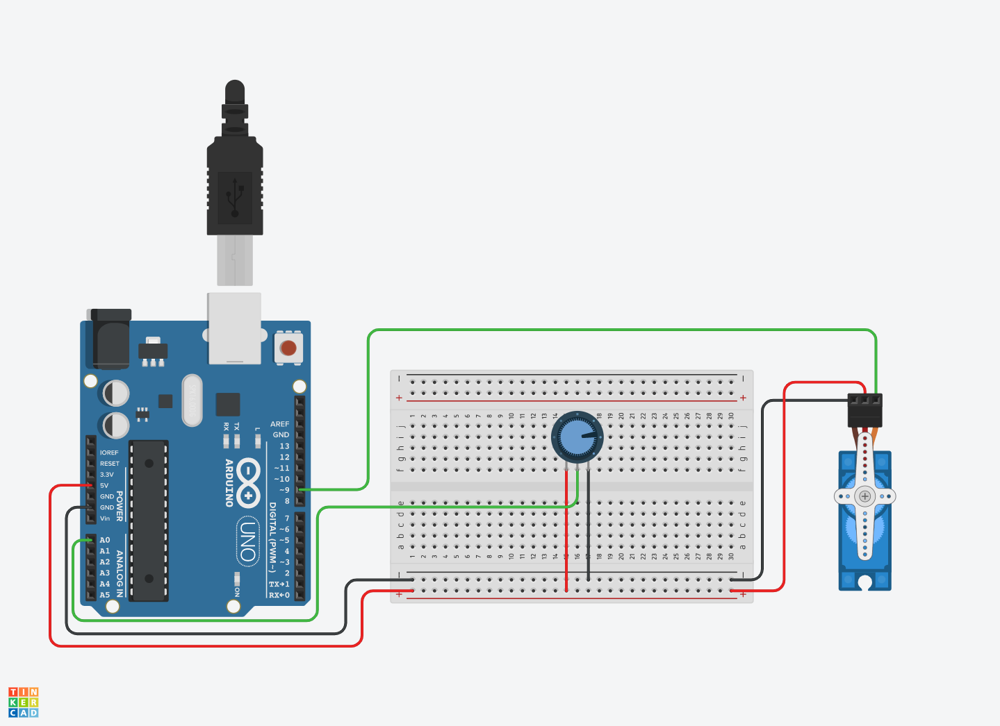

We now have the LED that can blink without a `delay();` function and a button that works to debounce without `delay();` but the servo examples, sweep and knob, both use `delay();`. This section shows how to remove the delay from the knob example but could be applied to sweep as well.

## Wrap the Task in a Millisecond Timer

This sketch simply takes the servo knob example from Arduino, and wraps it inside the millisecond timer function from blink without delay. [^1] For simple functions and timers this will work for most sketches.

Now another seperate task such as playing a sound, reading a sensor (like a button), flashing an LED can happen on their own timers.

## Servo Knob Without Delay Circuit

[](servo-knob-without-delay.png)

## Servo Know without Delay Sketch

```C
#include <Servo.h>

unsigned long previousMillis = 0;  // will store last time servo was updated

// constants won't change:
const long interval = 15;  // interval at which to update servo (milliseconds)


Servo myservo;  // create servo object to control a servo

int potpin = 0;  // analog pin used to connect the potentiometer
int val;    // variable to read the value from the analog pin

void setup() {
  myservo.attach(9);  // attaches the servo on pin 9 to the servo object
}

void loop() {
  unsigned long currentMillis = millis();


if (currentMillis - previousMillis >= interval) {

    previousMillis = currentMillis;      // save the last time you wrote to the servo

    val = analogRead(potpin);            // reads the value of the potentiometer (value between 0 and 1023)
    val = map(val, 0, 1023, 0, 180);     // scale it to use it with the servo (value between 0 and 180)
    myservo.write(val);                  // sets the servo position according to the scaled value
    }

}
```

[^1]: https://docs.arduino.cc/learn/electronics/servo-motors
