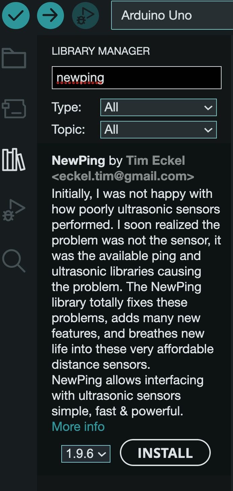
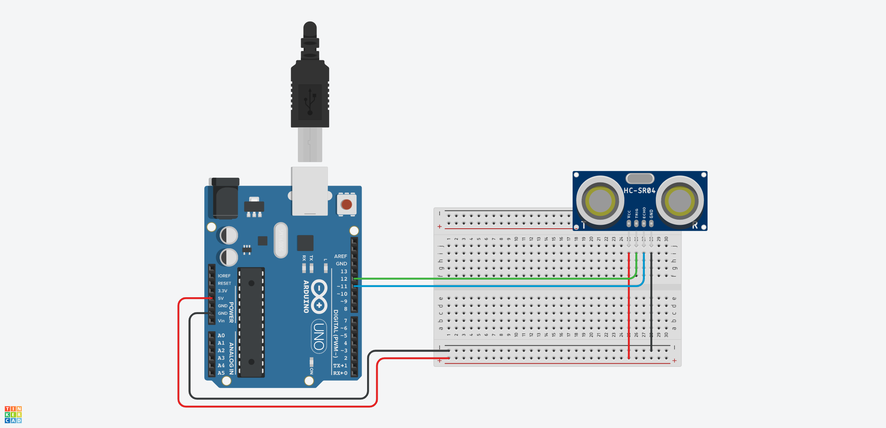

The previous ultrasonic sensor code example uses a state machine to control the timing of the pings and echos that determine an object's distance. This works but can be alot to include in your sketch, especially if you want to do other things and keep things tidy.

Fortunately there are many libraries available for the Arduino platform that perform basic functions such as pinging an ultrasonic sensor. One such library is the NewPing library. We will use many Arduino Libraries.

To use a library, you need to make sure it is installed on your computer and that you include it at the top of your sketch. You include a library by using `#include`. So to include the NewPing library, you install it in the IDE and then put `#include <NewPing.h>` at the top of your sketch.

## Installing the New Ping Library by Tim Eckel [^1]

<div class="two-column-instructions-grid">

- Click on the library icon
- Type newping into the search bar
- Install the NewPing library by Tim Eckel

[](newping-library-install.jpg)

</div>

## Basic Ultrasonic Sensor Circuit for Testing NewPing Library

[](ultrasonic-sensor-circuit.png)

### NewPing Example Sketch from the Documentation

This sketch starts the serial monitor and prints the distance from the sensor. There are variables to change the max distance that the sensor reads.

NOTE: If you do not see anything when you turn the serial monitor on make sure you set the speed in the serial monitor to 115200.

```C
// ---------------------------------------------------------------------------
// Example NewPing library sketch that does a ping about 20 times per second.
// ---------------------------------------------------------------------------

#include <NewPing.h>

#define TRIGGER_PIN  12  // Arduino pin tied to trigger pin on the ultrasonic sensor.
#define ECHO_PIN     11  // Arduino pin tied to echo pin on the ultrasonic sensor.
#define MAX_DISTANCE 200 // Maximum distance we want to ping for (in centimeters). Maximum sensor distance is rated at 400-500cm.

NewPing sonar(TRIGGER_PIN, ECHO_PIN, MAX_DISTANCE); // NewPing setup of pins and maximum distance.

void setup() {
  Serial.begin(115200); // Open serial monitor at 115200 baud to see ping results.
}

void loop() {
  delay(50);                     // Wait 50ms between pings (about 20 pings/sec). 29ms should be the shortest delay between pings.
  Serial.print("Ping: ");
  Serial.print(sonar.ping_cm()); // Send ping, get distance in cm and print result (0 = outside set distance range)
  Serial.println("cm");
}
```

## Ultrasonic Sensor Circuit with LED Added

This is the same ultrasonic sensor circuit with LED from the previous example with the state machine. Now we will blink the LED using the NewPing library. This also removes the 50 millisecond delay from the original example NewPing sketch.

[](ultrasonic-sensor-circuit-with-led.png)

### NewPing Example Sketch from the Documentation with Added LED

This sketch adds a blinking LED that activates when the ultrasonic sensor reads a specified distance.

```C
// ---------------------------------------------------------------------------
// Example NewPing library sketch that does a ping about 20 times per second.
// ---------------------------------------------------------------------------

#include <NewPing.h>

#define TRIGGER_PIN 12    // Arduino pin tied to trigger pin on the ultrasonic sensor.
#define ECHO_PIN 11       // Arduino pin tied to echo pin on the ultrasonic sensor.
#define MAX_DISTANCE 400  // Maximum distance we want to ping for (in centimeters). Maximum sensor distance is rated at 400-500cm.

NewPing sonar(TRIGGER_PIN, ECHO_PIN, MAX_DISTANCE);  // NewPing setup of pins and maximum distance.

// Added LED Blink Code
const int ultraLEDPin = 13;  // pin of LED to turn on with Ultrasonic sensor

int distance;            // Distance calculated by ultrasonic sensor
int reactDistance = 40;  // Distance the sensor reacts to in centimeters

unsigned long currentMilliseconds = 0;
unsigned long previousMillisecondsSampleSensors = 0;  // Time track for sensor reading
unsigned long previousMillisecondsUltra = 0;          // Time track for Ultrasonic Sensor
const long sampleSensorsInterval = 1000;              // time between printing sensor values
const long ultraSonicInterval = 50;                   // Wait 50ms between pings (about 20 pings/sec). 29ms should be the shortest delay between ultrasonic pings.

void setup() {
  Serial.begin(115200);          // Open serial monitor at 115200 baud to see ping results.
  pinMode(ultraLEDPin, OUTPUT);  // sets the ultraLEDpin as output
}

void loop() {
  currentMilliseconds = millis();  // set the current time in milliseconds

  // This if statement runs every 50 ms or the ultraSonicInterval Value
  if (currentMilliseconds - previousMillisecondsUltra >= ultraSonicInterval) {
    distance = sonar.ping_cm();  // sets the distance variable to the distance in cm

    if (distance <= reactDistance) {
      digitalWrite(ultraLEDPin, HIGH);
    } else {
      digitalWrite(ultraLEDPin, LOW);
    }
  }

  // This if statement prints to the serial monitor the value of sampleSensorsInterval in milliseconds

  if (currentMilliseconds - previousMillisecondsSampleSensors >= sampleSensorsInterval) {
    Serial.print("Ping: ");
    Serial.print(distance);  // print the distance variable value
    Serial.println("cm");
  }
}
```

[^1]: https://bitbucket.org/teckel12/arduino-new-ping/wiki/Home
