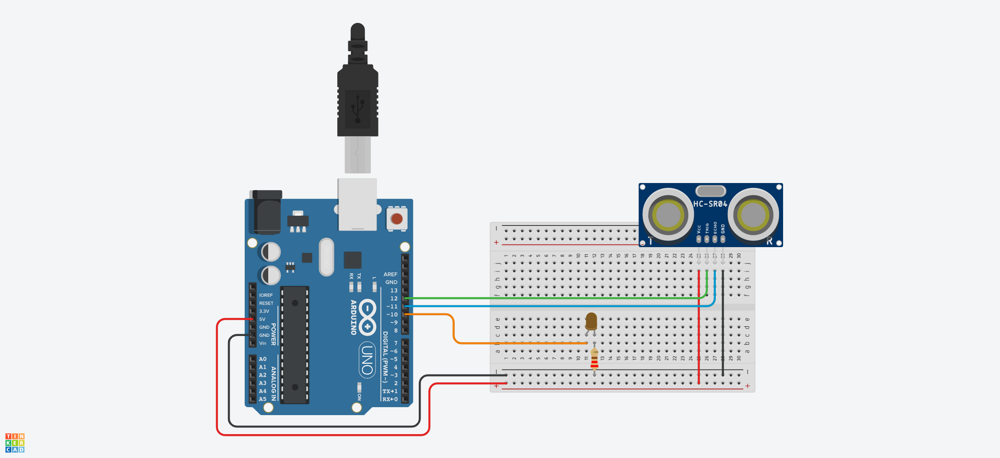
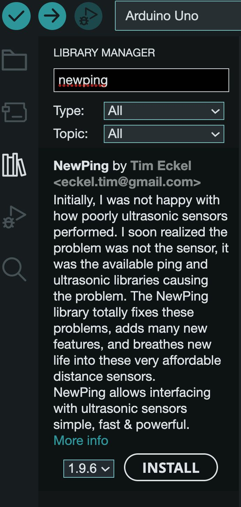

An ultrasonic sensor can send a sound wave out and measure the time it takes for it to bounce back off an object. By using the speed of sound, the distance to the "pinged" object can be determined. The Arduino can then perform functions based on the distance of objects.

## UltraSonic Sensor Circuit

Hook up GND and 5V to the breadboard power rail and connect the same GND and 5V pins on the ultrasonic sensor module to their respective spots on the breadboard power rail. The ultrasonic trig pin connects to 11 and the the ultrasonic echo pin connects to 12. To blink an LED based on the distance reading, hook up an LED and a resistor to pin 10.

[](ultrasonic-sensor-circuit-with-led.png)

## UltraSonic Code without the Delay

```C

/* Uses a state machine to read the ultrasonic sensor without delay */

const int ultraLED = 10; // pin of LED
const int trigPin = 11;  // trig pin of the ultrasonic sensor
const int echoPin = 12;  // echo pin of the ultrasonic sensor

long duration; // duration of the pin
int distance; // Distance calculated by ultrasonic sensor

const long sampleSensorsInterval = 500;  // time between printing sensor values
const long ultraSonicInterval = 100;     // time between reading Ultrasonic Sensor
const long clearTrigInterval = 2;        // time between clearing the Trig Pin
const long pulseTrigInterval = 10;       // time between pulsing the Trig Pin

// enumerates the states of the ultrasonic sensor state machine
enum sensorStates { CLEAR_TRIG_PIN,
                    PULSE_TRIG_PIN,
                    READ_DISTANCE,
                    TRIGGER_EVENT,
                    WAIT_DELAY };

enum sensorStates ultraSonicState = CLEAR_TRIG_PIN; // sets the initial state to CLEAR_TRIG_PIN

unsigned long currentMilliseconds = 0;
unsigned long currentMicroseconds = 0;
unsigned long previousMillisecondsSampleSensors = 0;  // Time track for sensor reading
unsigned long previousMillisecondsUltra = 0;          // Time track for Ultrasonic Sensor
unsigned long previousMicrosecondsUltra = 0;          // Time track for Ultrasonic Sensor

void setup() {
  Serial.begin(9600);  // start serial monitor
  pinMode(trigPin, OUTPUT);  // Sets the trigPin as an Output
  pinMode(echoPin, INPUT);   // Sets the echoPin as an Input
}

void loop() {
  currentMilliseconds = millis();
  currentMicroseconds = micros();
  ultraSonic();
  printData();
}

void printData() {
  if (currentMilliseconds - previousMillisecondsSampleSensors >= sampleSensorsInterval) {
    // save the last time you checked the sensors
    previousMillisecondsSampleSensors = currentMilliseconds;
    // Prints the Ultrasonic distance on the Serial Monitor
    Serial.print("Distance: ");
    Serial.print(distance);
    Serial.println(" centimeters");
  }
}
void ultraSonic() {
  switch (ultraSonicState) {
    case CLEAR_TRIG_PIN:           // toggle the LED
      digitalWrite(trigPin, LOW);  // Clears the trigPin
      if (micros() - previousMicrosecondsUltra >= clearTrigInterval)
        previousMicrosecondsUltra = micros();
      ultraSonicState = PULSE_TRIG_PIN;
      break;

    case PULSE_TRIG_PIN:            // wait for the delay period
      digitalWrite(trigPin, HIGH);  // Sets the trigPin on HIGH state for 10 micro seconds
      if (millis() - previousMicrosecondsUltra >= pulseTrigInterval)
        ultraSonicState = READ_DISTANCE;
      break;

    case READ_DISTANCE:                   // wait for the delay period
      digitalWrite(trigPin, LOW);         // Clears the trigPin
      duration = pulseIn(echoPin, HIGH);  // Reads echoPin, returns sound travel in microseconds
      distance = duration * 0.034 / 2;    // Calculating the distance
      ultraSonicState = TRIGGER_EVENT;
      break;

    case TRIGGER_EVENT:                   // do some cool thing
      if (distance <= 400) {
        digitalWrite(ultraLED, HIGH);     // Turns on the LED
      } else {
        digitalWrite(ultraLED, LOW);      // Turns off the LED
      }
      ultraSonicState = WAIT_DELAY;
      break;

    case WAIT_DELAY:                      // wait for the delay period
      if (millis() - previousMillisecondsUltra >= ultraSonicInterval) {
        ultraSonicState = CLEAR_TRIG_PIN;
      }
      break;

    default:
      ultraSonicState = WAIT_DELAY;
      break;
  }
}
```

## Install the NewPing library by Tim Eckel [^1]

The NewPing library makes using the ultrasonic sensor super simple. All of the timing and reading of the sensor is contained in the library. This keeps the main sketch code simpler and easier to read.

<div class="two-column-instructions-grid">

- Click on the library icon
- Type newping into the search bar
- Install the NewPing library by Tim Eckel

[](newping-library-install.jpg)

</div>

### Example Sketch from NewPing Documentation

```C
// ---------------------------------------------------------------------------
// Example NewPing library sketch that does a ping about 20 times per second.
// ---------------------------------------------------------------------------

#include <NewPing.h>

#define TRIGGER_PIN  12  // Arduino pin tied to trigger pin on the ultrasonic sensor.
#define ECHO_PIN     11  // Arduino pin tied to echo pin on the ultrasonic sensor.
#define MAX_DISTANCE 200 // Maximum distance we want to ping for (in centimeters). Maximum sensor distance is rated at 400-500cm.

NewPing sonar(TRIGGER_PIN, ECHO_PIN, MAX_DISTANCE); // NewPing setup of pins and maximum distance.

void setup() {
  Serial.begin(115200); // Open serial monitor at 115200 baud to see ping results.
}

void loop() {
  delay(50);                     // Wait 50ms between pings (about 20 pings/sec). 29ms should be the shortest delay between pings.
  Serial.print("Ping: ");
  Serial.print(sonar.ping_cm()); // Send ping, get distance in cm and print result (0 = outside set distance range)
  Serial.println("cm");
}
```

### Basic Ultrasonic Sensor Circuit for Testing NewPing Library

[](ultrasonic-sensor-circuit.png)

[^1]: https://bitbucket.org/teckel12/arduino-new-ping/wiki/Home
