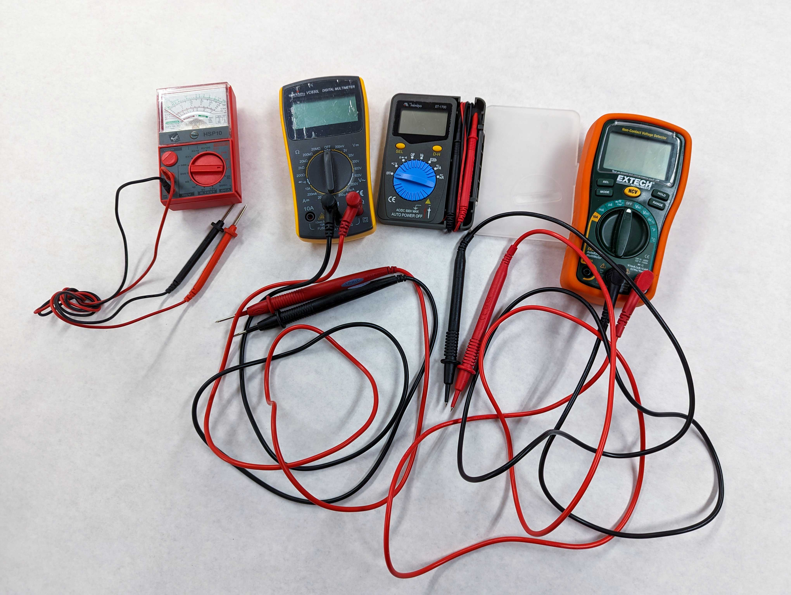

A multimeter can be used to measure voltage, resistance, current, and continuity. It is helpful in diagnosing problems in projects as well as the specific attributes of an electronic component. Multimeters range from the very cheap to the very expensive but for the basic functions, any inexpensive multimeter will work fine.

## Parts of Multi Meeter

Multimeters have two leads that are used for connecting to circuits and components to test. There is a screen that shows information and values from tests performed. It also has a control knob or switch to select what type of measurement is desired.

