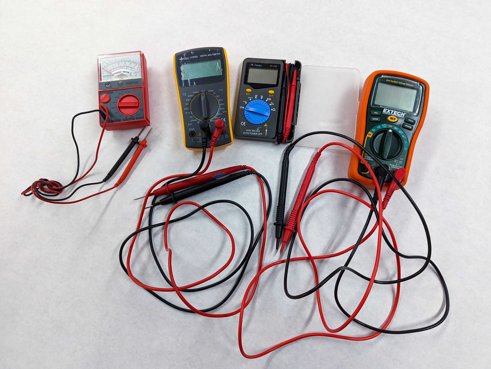

A multimeter can be used to measure voltage, resistance, current, and continuity. It is helpful in diagnosing problems in projects as well as the specific attributes of an electronic component. Multimeters range from the very cheap to the very expensive but for the basic functions, any inexpensive multimeter will work fine.

## Parts of Multi Meeter

Multimeters have two leads that are used for connecting to circuits and components to test. There is a screen that shows information and values from tests performed. It also has a control knob or switch to select what type of measurement is desired.

## Measuring Continuity

A multimeter can detect if two locations on a conductive material connect. If you put both probes in contact with a metal pipe, it will sense that the metal is continuous and beep for positive continuity. This is not that useful since you can just look a the pipe.

What about detecting a break in a long coiled wire? If you strip both ends of the wire, touch one probe to one end and the other probe to the other end then the multimeter will beep with continuity detected if there are no breaks, or it will stay silent if there are breaks in the middle of the wire.

This is very useful for testing circuits and solder connections. It can be used to see if connections are continuous on a breadboard during prototyping. It can also check if you fabricated circuit soldered on a perfboard is connected properly.

## Measuring Voltage

Some multimeters automatically sense the voltage range but many require the use to select the range for the voltage reading. WHen you have no idea what the voltage will be it is best to start with the highest range and then move to lower ranges. If you have an idea of what the voltage will be, for example measuring a battery, then you can pick a range that is in line with your expected voltage reading.

To read DC voltage, turn the knob or selection switch to the ⎓ Direct Current Symbol. It is represented by a solid line with a dotted line below.

To read DC voltage, turn the knob or selection switch to the ⏦ Alternating Current Symbol. It is represented by a sine wave with a line through it or by a simple sine wave ∿. It can also be written as VAC, or Voltage Alternating Current.

Some multimeters measure AC an DC voltage with the same setting. That is usually marked with a straight line with a wavy line underneath.

## Measuring Resistance

## Measuring Current
