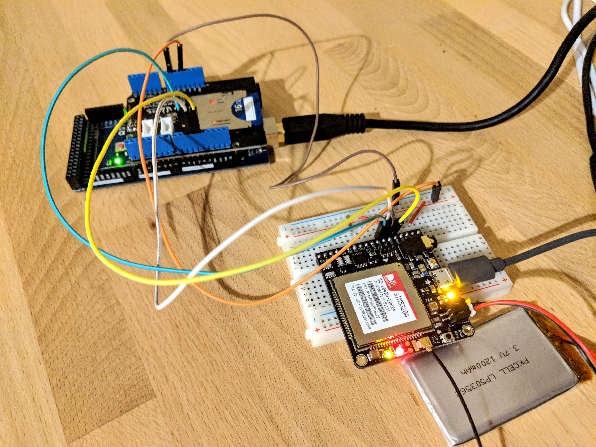
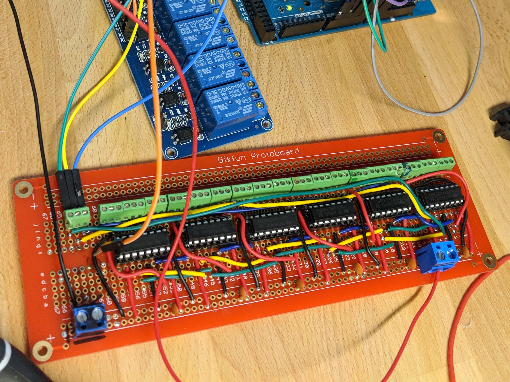

## Breadboard Prototypes

## Perfboard Prototypes

### Perfboard

## Perfboard Layout Resources

[Hacked From Pieces Perfboard Process](https://hackedfrompieces.wordpress.com/2013/03/17/tutorial-professional-perfboard/) [(Web Archive)](https://web.archive.org/web/20190610005447/https://hackedfrompieces.wordpress.com/2013/03/17/tutorial-professional-perfboard/) - Shows interesting ways to transfer toner markings of designs onto perfboard to aid assembly and layout.

[Nuts and Volts Stripboard Prototyping](https://www.nutsvolts.com/magazine/article/june2013_Dratwa) [(Web Archive)](https://web.archive.org/web/20220611201804/https://www.nutsvolts.com/magazine/article/june2013_Dratwa)

[Circuit Board Prototyping Tips and Tricks](https://www.youtube.com/watch?v=J9Ig1Sxhe8Y) - Youtube Video with prototyping tips
