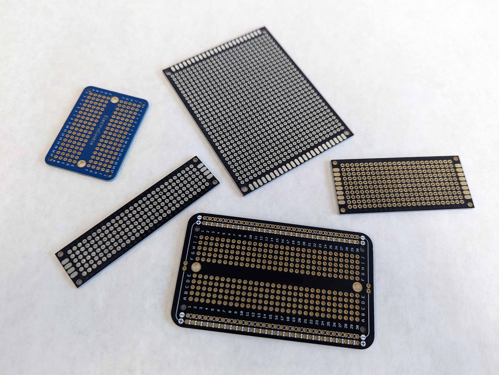

## Breadboard Prototypes

Breadboards are used at the beginning of a project to layout a circuit and test if it works. Breadboards are convenient because assembling one is fast and it is easy to make changes. This ease of change is also a liability. Jumper wire connections can easily fall out and sometimes have loose connections. Therefore breadboards are generally not the best choice for anything but a temporary setup. Once a circuit design, function, or layout has been proven on a breadboard it is time to transfer that work to a more permanent setup. Eventually that could mean a custom printed circuit board but that has the costs of design, fabrication, and waiting for the board. The next best thing is a soldered perfboard. Perfboard prototypes offer robust and durable circuits that can be used in long term projects.

## Perfboard Prototypes

This perfboard features a series of shift registers. These expand the input / output or IO of the Arduino to be able to control more pins. The components are laid out in an orderly fashion. Insulated wires make connections between the chips, ceramic capacitors (orange components), and the smaller green screw terminals. Larger blue screw terminals accept DC power.

### Perfboard

There are many different types of perfboard.

## Perfboard Layout Resources

[Hacked From Pieces Perfboard Process](https://hackedfrompieces.wordpress.com/2013/03/17/tutorial-professional-perfboard/) [(Web Archive)](https://web.archive.org/web/20190610005447/https://hackedfrompieces.wordpress.com/2013/03/17/tutorial-professional-perfboard/) - Shows interesting ways to transfer toner markings of designs onto perfboard to aid assembly and layout.

[Nuts and Volts Stripboard Prototyping](https://www.nutsvolts.com/magazine/article/june2013_Dratwa) [(Web Archive)](https://web.archive.org/web/20220611201804/https://www.nutsvolts.com/magazine/article/june2013_Dratwa)

[Circuit Board Prototyping Tips and Tricks](https://www.youtube.com/watch?v=J9Ig1Sxhe8Y) - Youtube Video with prototyping tips
