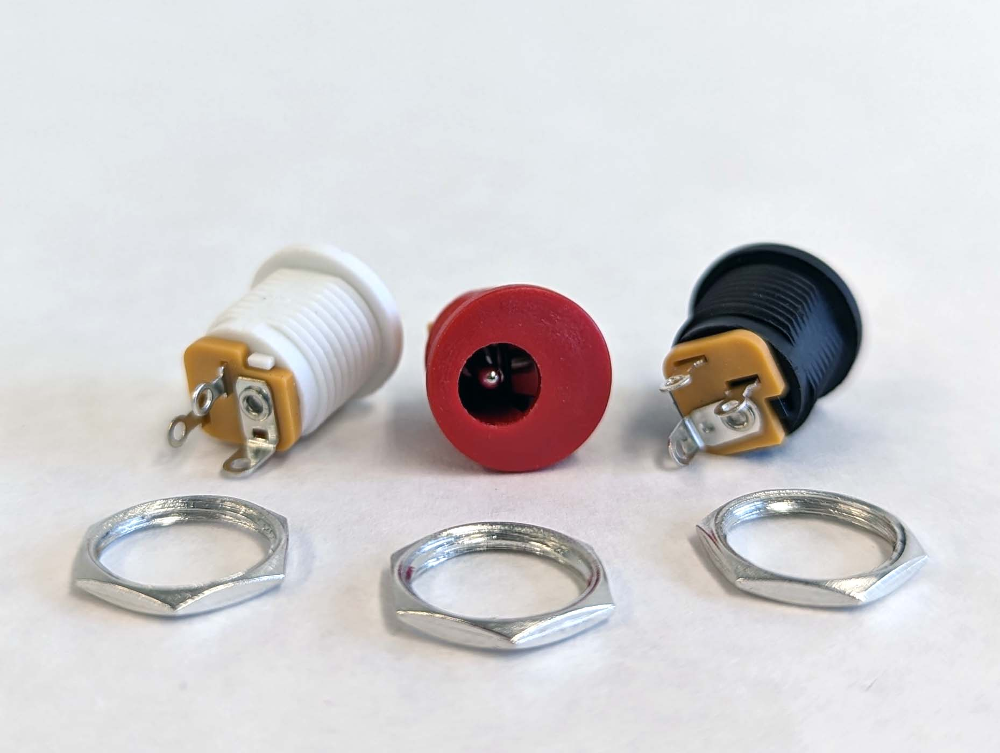

## DC Power Barrel Jack Connectors

]2023-panel-mount-dc-power-barrel-jacks.jpg

DC power is essential for most electronics projects. Having a panel mount receptacle for DC power makes for a clean install and easy transport since you can simply unplug the power supply.

## Aviation Connectors

Aviation connectors allow for the secure connection of multi pin terminals and can handle reasonable current. They often feature cup terminals for soldering wire connections to them and have secure screw on fittings.

[Pace Cup Terminal Soldering Tutorial Video](https://youtu.be/_GLeCt_u3U8)
